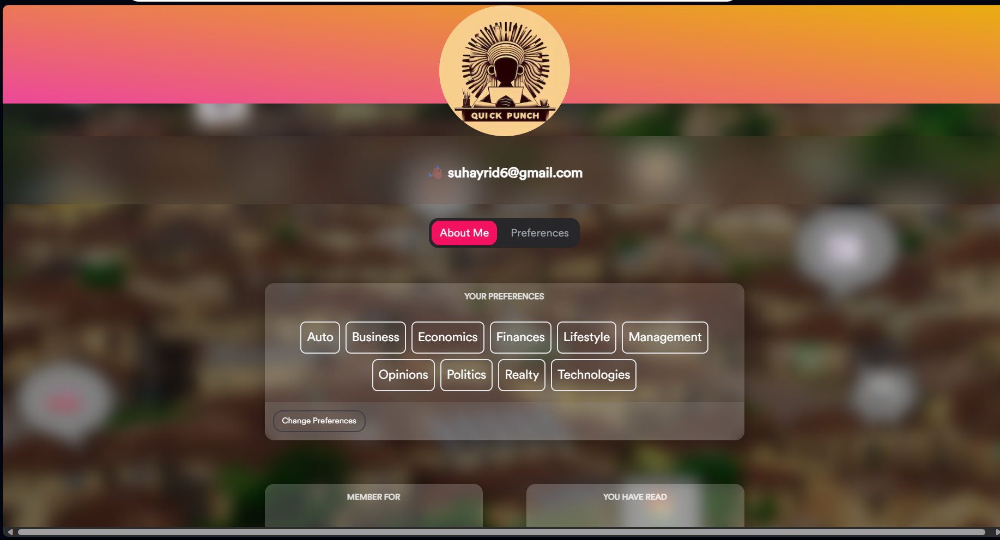

# QuickPunch
Get summaries of your daily Nigerian news in Deedax style!



## Introduction
QuickPunch is a simple news aggreagator that uses the PunchNG to summarize Nigerian news. Subscribers can choose to receive daily summaries of the top headlines in Nigerian news based on their interests.

For the back-end, check [here](https://github.com/Daheer/QuickPunch)

## Demo
Live hosted version of QuickPunch can be found [here](https://quick-punch.vercel.app/)

## How does it work?

QuickPunch 
 - Fetches live Nigerian news from [PunchNG's RSS Feed](https://rss.punchng.com/)
 - Scrapes the actual news articles from links provided by the RSS feed
 - Stores the news articles in a Supabase database
 - Uses a [BART model finetuned on CNN Daily Mail](https://huggingface.co/facebook/bart-large-cnn) to summarize the news articles
 - Uses a [News Topic Classification model](https://huggingface.co/kartashoffv/news_topic_classification) to categorize the news articles
 - Sends the summaries to subscribers via email

## Project Structure

```bash
📦QuickPunch
├── LICENSE
├── README.md
└── quickpunch
    ├── README.md
    ├── app
    │   ├── api
    │   │   ├── getArticles
    │   │   │   └── route.js
    │   │   ├── getPreferences
    │   │   │   └── route.js
    │   │   ├── getSummaries
    │   │   │   └── route.js
    │   │   └── updatePreferences
    │   │       └── route.js
    │   ├── components
    │   │   ├── modal.js
    │   │   └── supabaseOps.js
    │   ├── dashboard
    │   │   ├── loading.js
    │   │   └── page.js
    │   ├── globals.css
    │   ├── layout.js
    │   ├── loading.js
    │   ├── page.js
    │   └── providers.jsx
    ├── components.json
    ├── font
    │   └── CircularStd-Book.ttf
    ├── google4bb7104b7553c268.html
    ├── jsconfig.json
    ├── lib
    │   └── utils.js
    ├── next.config.js
    ├── package-lock.json
    ├── package.json
    ├── postcss.config.js
    ├── public
    │   ├── backgroundv5.jpg
    │   ├── backgroundv6.jpeg:Zone.Identifier
    │   ├── emojis
    │   │   ├── auto.png
    │   │   ├── auto.svg
    │   │   ├── business.png
    │   │   ├── economics.png
    │   │   ├── finances.png
    │   │   ├── lifestyle.png
    │   │   ├── management.png
    │   │   ├── opinions.png
    │   │   ├── politics.png
    │   │   ├── realty.png
    │   │   └── technologies.png
    │   ├── google4bb7104b7553c268.html
    │   └── quickpunch.jpeg
    └── tailwind.config.js

```

## Usage

#### Dev
```bash
npm run dev
```
#### Production
```bash
npm run build
npm run start
```

## Contributing

Pull requests are welcome. For major changes, please open an issue first to discuss what you would like to change.
Please reach out to me @ suhayrid6@gmail.com, I'd be happy to walk you through the project, including the Supabase database configuration


